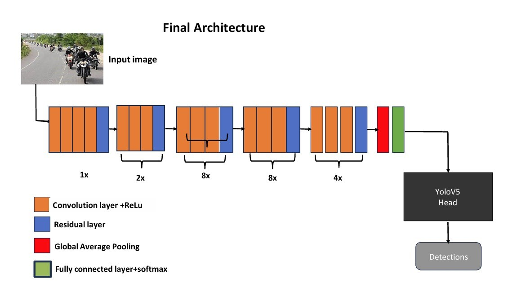
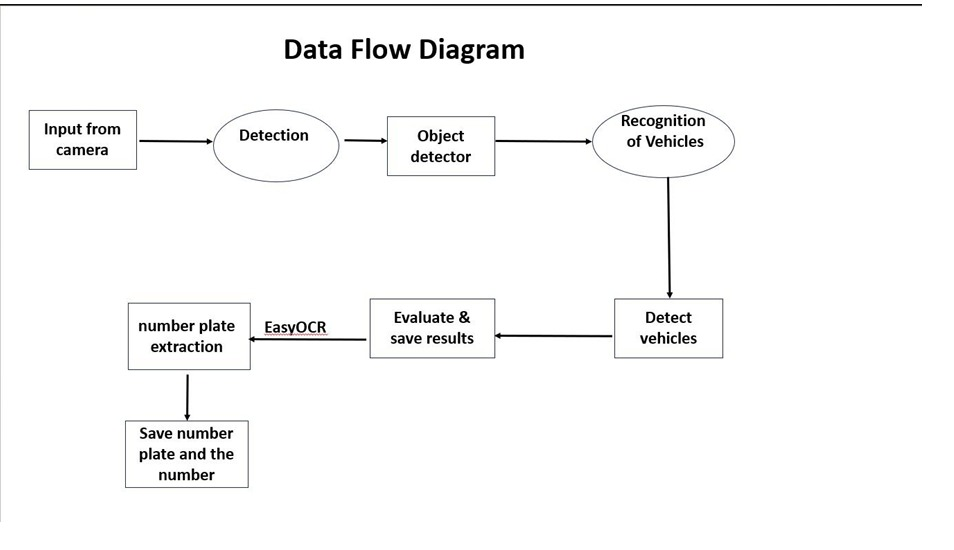
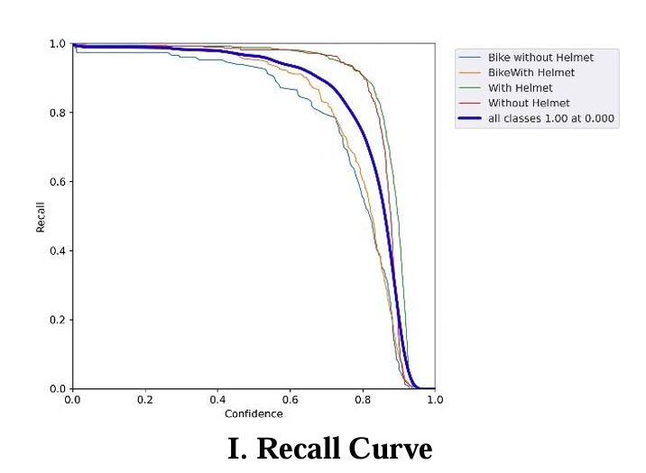

# 1. DATA
## 1.1 Dataset

<div align="justify">
The success of any deep learning model heavily relies on the quality and diversity of the dataset used for training. In our project focusing on traffic violation detection using Deep Learning, meticulous attention was paid to curating and pre-processing a comprehensive dataset. This page elucidates the details of our dataset, encompassing its origins, augmentation techniques employed, and the partitioning strategy adopted for training, validation, and testing.
</div>

## 1.2 Dataset Acquisition and Augmentation

<div align="justify">
Our dataset was initially sourced from Kaggle, a prominent platform for sharing and discovering datasets. Specifically, we leveraged a dataset consisting of images depicting individuals riding bicycles, some with helmets and others without. Given the significance of diversity and volume in training robust deep learning models, we augmented the pre-existing dataset of 1000 images. We employed various augmentation techniques to enhance the dataset's diversity and mitigate overfitting. One such method involved augmenting the HUE and BRIGHTNESS of the pictures by ±15% and the SATURATION and EXPOSURE by ±10%. Additionally, a minute amount of NOISE was introduced into the dataset. We significantly expanded the dataset through these augmentation strategies, resulting in a new augmented dataset comprising 3000 images.
</div>

## 1.3 Data Augmentation Tools

<div align="justify">
Roboflow, a popular platform for managing and augmenting datasets, 
was instrumental in executing the augmentation process. Its user-friendly interface and extensive 
suite of augmentation options facilitated seamless augmentation while ensuring the integrity of the 
dataset. Furthermore, Roboflow facilitated dataset annotations, a crucial step in supervising the 
training process and enabling the model to learn from labelled data. 
</div>

## 1.4 Dataset Partitioning
The augmented dataset was partitioned into three 
subsets: training, validation, and testing. The partitioning ratio was established as 60:20:20, 
ensuring a balanced data distribution across the subsets. This partitioning strategy is paramount 
in evaluating the model's performance effectively, as it enables rigorous testing on unseen data 
while validating the model's efficacy during training. 

# 2. Model Architecture
## 2.1

## 2.2


# 3. Model Training
<div align="justify">
Load the data using the roboflow link in the notebook. If the dataset loading fails for you, you can use the dataset provided in this repository with JSON files containing the annotations. Training of the YOLOv5 model is conducted using the motorcycle helmet detection dataset. The model is optimized using stochastic gradient descent (SGD) with momentum, and learning rate scheduling techniques are employed to prevent overfitting and achieve optimal performance. The dataset is partitioned into training, validation, and test sets to accurately assess the model's generalization ability. Performance evaluation is carried out on the test set using standard metrics such as mean average precision (mAP) and precision-recall curves to quantify the model's effectiveness in detecting motorcycle riders wearing helmets. Additionally, qualitative analysis through visual inspection of model predictions is performed to identify potential failure cases and areas for improvement.
</div>

## Training Script
In this part of code block you can change the directory in collab where you want to store the model weights

```python
RES_DIR = set_res_dir()
if TRAIN:
    !python train.py --data ../data.yaml --weights yolov5s.pt \
    --img 640 --epochs {EPOCHS} --batch-size 16 --name {RES_DIR}\
    --project /content/Model_Weights  # <-- This is where the best and last training weights are stored.
```
```python
def inference(RES_DIR, data_path):
    # Directory to store inference results.
    infer_dir_count = len(glob.glob('/content/yolov5/runs/detect/*'))
    print(f"Current number of inference detection directories: {infer_dir_count}")
    INFER_DIR = f"inference_{infer_dir_count+1}"
    print(INFER_DIR)
    # Inference on images.
    !python detect.py --weights {RES_DIR}/weights/best.pt #remove the extra \ this is where the inference image is stored so that you can copy the path and use it to visualize in the last code block of the file
    --source {data_path} --name {INFER_DIR}
    return INFER_DIR
```
```python
IMAGE_INFER_DIR = inference("path to model weights", "path to the image you wanna do inference")
```
Sample images from Google have been added in the Images directory on which I compiled the inference

# 4. Easy OCR
The Initial OCR implementation was done just to test on number plates to see if it detects well or not
```python
import torch
import pandas as pd
from pathlib import Path

def inference_and_save_csv(weights_path, image_path, output_csv_path):
    # Load YOLOv5 model
    model = torch.hub.load('ultralytics/yolov5', 'custom', path=weights_path, force_reload=True)

    # Run inference
    results = model(image_path)

    # Get detection results as a Pandas DataFrame
    detections = results.pandas().xyxy[0]  # Bounding boxes and detection info

    # Debug: Print detection results
    print(detections)

    # Save detections to a CSV file
    output_csv_path = Path(output_csv_path)
    output_csv_path.parent.mkdir(parents=True, exist_ok=True)  # Ensure directory exists
    detections.to_csv(output_csv_path, index=False)

    print(f"Detections saved to CSV: {output_csv_path}")

# Example usage
weights_path = '/content/best (1).pt'
image_path = '/content/motorcycle-tours-india.jpg'
output_csv_path = '/content/detections.csv'

inference_and_save_csv(weights_path, image_path, output_csv_path)
```
This prints the detections in the image 
The last code block is similar but not same, this will save the detections of number plates to the csv files 
```python
# Example usage
weights_path = '/content/best (1).pt'
image_path = '/content/motorcycle-tours-india.jpg'
output_csv_path = '/content/detections.csv'

inference_and_save_csv(weights_path, image_path, output_csv_path)
```
# 5. Metrics Graphs
<p float="left">
  
  
</p>
<p float="left"> 
     
     
    
</p>
